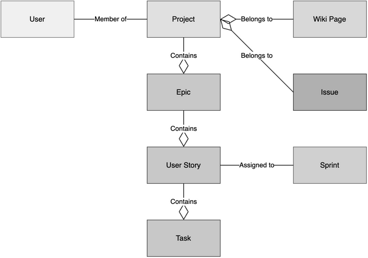
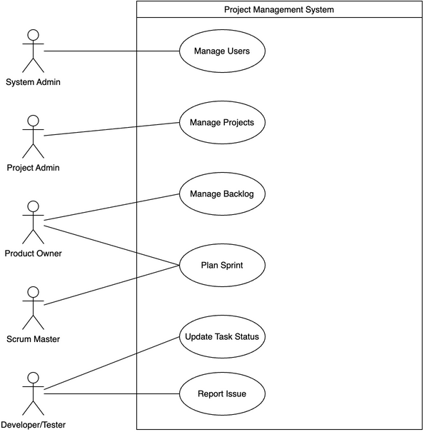

# 软件需求规格说明书 (SRS)

## 目录

### 1. 引言
- 1.1 目的
- 1.2 范围
  - 1.2.1 系统功能范围
  - 1.2.2 系统边界与排除范围
- 1.3 定义、首字母缩写和缩略语
  - 1.3.1 首字母缩写和缩略语
  - 1.3.2 术语定义
- 1.4 引用文件
- 1.5 综述

### 2. 总体描述
- 2.1 产品描述
  - 2.1.1 系统架构
  - 2.1.2 系统定位
  - 2.1.3 与现有系统的关系
- 2.2 产品功能
- 2.3 用户特点
  - 2.3.1 系统管理员
  - 2.3.2 项目管理员
  - 2.3.3 产品负责人
  - 2.3.4 Scrum Master
  - 2.3.5 开发人员
  - 2.3.6 测试人员
  - 2.3.7 观察者/利益相关者
- 2.4 约束
  - 2.4.1 技术约束
  - 2.4.2 开发约束
  - 2.4.3 标准依从性约束
  - 2.4.4 运行环境约束
- 2.5 假设和依赖关系
  - 2.5.1 假设条件
  - 2.5.2 依赖关系
- 2.6 需求分配

### 3. 具体需求
- 3.1 外部接口需求
  - 3.1.1 用户界面
  - 3.1.2 硬件接口
  - 3.1.3 软件接口
  - 3.1.4 通信接口
- 3.2 功能需求
  - 3.2.1 用户账户管理
  - 3.2.2 项目管理
  - 3.2.3 待办事项(Backlog)管理
  - 3.2.4 冲刺(Sprint)管理
  - 3.2.5 看板(Kanban)管理
  - 3.2.6 问题(Issue)管理
  - 3.2.7 Wiki知识库
  - 3.2.8 权限与角色管理(RBAC)
  - 3.2.9 通知系统
- 3.3 性能需求
- 3.4 设计约束
- 3.5 软件系统属性
- 3.6 其他需求

### 附录
- 附录A 缩略语对照表
- 附录B 需求追踪矩阵

### 索引

---

## 1. 引言

### 1.1 目的
本文档旨在全面、准确地定义**初创软件公司内部项目管理系统**（以下简称"本系统"）的软件需求。该系统旨在为初创团队提供一个高效、灵活、易于使用且功能完备的项目管理平台，全面支持敏捷开发方法（包括 Scrum 和 Kanban），以显著提高团队协作效率、项目可视化程度和项目交付质量。

本文档的主要目的包括：

1.  **明确系统功能边界**：详细定义系统应当实现的功能特性和不应实现的功能边界，为开发团队提供清晰的实现目标。
2.  **统一需求理解**：确保所有项目相关方（包括业务方、开发团队、测试团队、系统架构师、项目经理等）对系统需求有一致的理解，避免需求歧义导致的返工。
3.  **作为设计依据**：为后续的系统设计、架构设计、数据库设计、接口设计等工作提供权威的需求基础。
4.  **作为测试依据**：为测试团队编写测试用例、验收测试提供明确的验收标准和质量基线。
5.  **支持项目管理**：为项目经理进行工作量估算、进度规划、风险管理提供依据。

本文档的预期读者包括但不限于：
*   **项目经理**：了解项目范围、进度安排和资源需求。
*   **软件开发人员**：理解系统功能需求和技术约束，进行系统开发。
*   **测试工程师**：基于需求编写测试计划和测试用例。
*   **系统架构师**：进行系统架构设计和技术选型。
*   **UI/UX 设计师**：设计符合用户需求的界面和交互流程。
*   **质量保证团队**：进行需求评审和质量把关。
*   **业务分析师和产品经理**：确认需求的完整性和准确性。

### 1.2 范围
本系统是一个基于 Web 的项目管理平台，专为初创软件公司的敏捷开发团队设计。系统采用 B/S（浏览器/服务器）架构，用户通过 Web 浏览器即可访问和使用全部功能，无需安装客户端软件。

#### 1.2.1 系统功能范围

本系统的核心功能模块包括：

**1. 项目管理模块**
*   支持创建、配置、编辑、归档和删除项目。
*   支持公有项目（Public Project）和私有项目（Private Project）两种可见性模式。
*   支持项目模板选择（如 Scrum 模板、Kanban 模板、混合模板）。
*   支持项目 Logo、描述、Slug（URL 友好标识符）等基本属性配置。
*   支持项目成员管理，包括邀请成员、移除成员、分配角色权限。
*   支持按需启用或禁用项目功能模块（Epics, Backlog, Kanban, Wiki, Issues, 联系表单等）。

**2. 敏捷开发支持模块**

*   **Scrum 子模块**：
    *   **产品待办列表（Product Backlog）管理**：支持创建、编辑、删除用户故事（User Story），为用户故事估算复杂度点数（Story Points），按业务价值排序用户故事优先级。
    *   **冲刺（Sprint/Milestone）规划**：支持创建冲刺，设定冲刺的开始日期、结束日期和目标，将待办列表中的用户故事分配到冲刺中，管理冲刺容量（Velocity）。
    *   **任务板（Task Board）**：在冲刺内将用户故事分解为具体的任务（Task），跟踪任务状态（如：待办、进行中、已完成），支持拖拽式任务状态更新。
    *   **燃尽图（Burndown Chart）**：可视化展示冲刺进度，包括剩余工作量趋势和理想趋势线对比。

*   **Kanban 子模块**：
    *   **看板视图（Kanban Board）**：提供可视化的看板界面，展示用户故事或任务的状态流转（如：待办 -> 进行中 -> 审核 -> 完成）。
    *   **泳道（Swimlanes）管理**：支持按不同维度（如优先级、指派人、用户故事类型）划分泳道，提供多维度视角。
    *   **WIP 限制（Work In Progress Limit）**：支持为每个看板列设置在制品数量上限，防止过载。
    *   **看板列自定义**：支持自定义看板列名称、顺序和颜色。

**3. 史诗（Epics）管理模块**
*   支持创建和管理大型需求（Epic），通常一个 Epic 对应多个 User Story。
*   支持查看 Epic 的完成进度（基于关联的 User Story 的完成情况）。
*   支持 Epic 与多个 Sprint 关联，追踪跨迭代的需求实现。

**4. 问题跟踪（Issue Tracking）模块**
*   支持创建、编辑、删除问题（Issue），问题可以是缺陷（Bug）、改进建议（Enhancement）或任务（Task）。
*   支持为问题定义类型（Type）、严重程度（Severity）、优先级（Priority）、状态（Status）等属性。
*   支持为问题上传附件（截图、日志文件、文档等）。
*   支持对问题进行评论和讨论。
*   支持将问题指派给特定的项目成员，并跟踪问题的生命周期。
*   支持问题的状态流转（如：新建 -> 分配 -> 处理中 -> 待验证 -> 已解决 -> 已关闭）。

**5. Wiki 知识库模块**
*   支持创建、编辑、删除 Wiki 页面，用于记录项目文档、技术规范、会议记录等。
*   支持 Markdown 语法编辑，并提供实时预览功能。
*   支持 Wiki 页面的层级结构管理（父页面、子页面）。
*   支持 Wiki 页面间的链接（内部链接）。
*   支持 Wiki 页面的历史版本记录，可查看和回滚到历史版本。

**6. 用户与权限管理模块**
*   支持用户注册、登录、密码重置、个人资料管理。
*   支持基于角色的访问控制（RBAC，Role-Based Access Control）。
*   预定义多种角色权限集合（如：项目管理员、产品负责人、Scrum Master、开发人员、测试人员、观察者等）。
*   支持自定义角色，灵活组合权限项（如：查看、创建、编辑、删除、评论等操作权限）。
*   支持项目级别的权限控制，不同项目可以有不同的成员和权限配置。

**7. 统计与报表模块**
*   提供冲刺燃尽图（Sprint Burndown Chart），展示剩余工作量趋势。
*   提供速度图（Velocity Chart），展示团队历史迭代的完成情况。
*   提供累积流图（Cumulative Flow Diagram），展示工作项在各状态的分布趋势。
*   提供项目活动统计（如：新增用户故事数、已完成任务数、活跃成员数等）。

**8. 搜索与过滤模块**
*   支持全文搜索，快速定位项目内容（用户故事、任务、问题、Wiki 页面等）。
*   支持高级过滤器，按状态、标签、指派人、创建时间、优先级等多维度筛选数据。

**9. 通知系统模块**
*   支持邮件通知和站内通知两种方式。
*   支持用户自定义通知策略（如：仅关注的项目、仅提及我的内容、所有活动）。
*   当项目内容（用户故事、任务、问题等）发生变更时，自动通知相关关注者。

#### 1.2.2 系统边界与排除范围

为了保持系统的聚焦性和可实现性，本系统**不包括**以下功能：

*   **财务管理功能**：不包含预算管理、成本核算、发票管理等财务功能。
*   **人力资源管理（HRM）功能**：不包含员工档案管理、考勤管理、薪资管理等 HR 功能。
*   **源代码托管功能**：不提供 Git 仓库托管服务，但支持与外部代码托管平台（如 GitHub、GitLab、Bitbucket）集成。
*   **持续集成/持续部署（CI/CD）功能**：不提供构建、测试、部署的自动化流水线，但支持与外部 CI/CD 工具（如 Jenkins、GitLab CI）集成。
*   **即时通讯（IM）功能**：不提供内置的聊天工具，但支持与外部通讯工具（如 Slack、Microsoft Teams）集成。
*   **复杂的报表定制和数据分析**：仅提供基本的统计图表，不提供类似 BI（商业智能）工具的复杂报表定制和数据挖掘功能。

本系统的目标用户主要是 **5-50 人规模的初创软件开发团队**，适用于采用敏捷开发方法（Scrum 或 Kanban）的项目管理场景。

### 1.3 定义、首字母缩写和缩略语

为确保文档的清晰性和一致性，本节列出了文档中使用的关键术语、首字母缩写和缩略语的定义。

#### 1.3.1 首字母缩写和缩略语

*   **SRS**：Software Requirements Specification，软件需求规格说明书。本文档的简称。
*   **RBAC**：Role-Based Access Control，基于角色的访问控制。一种权限管理模型，根据用户角色授予权限。
*   **API**：Application Programming Interface，应用程序编程接口。软件组件之间交互的接口规范。
*   **REST**：Representational State Transfer，表述性状态转移。一种 Web 服务架构风格。
*   **UI**：User Interface，用户界面。用户与系统交互的可视化界面。
*   **UX**：User Experience，用户体验。用户使用产品过程中的主观感受。
*   **CRUD**：Create, Read, Update, Delete，创建、读取、更新、删除。数据库操作的四个基本功能。
*   **WIP**：Work In Progress，在制品。看板方法中，正在处理但未完成的工作项数量。
*   **BI**：Business Intelligence，商业智能。用于数据分析和决策支持的技术和方法。
*   **CI/CD**：Continuous Integration / Continuous Deployment，持续集成/持续部署。软件开发的自动化实践。
*   **IM**：Instant Messaging，即时通讯。实时文本消息传递服务。
*   **JWT**：JSON Web Token，JSON 网络令牌。一种用于身份验证的令牌标准。

#### 1.3.2 术语定义

*   **Scrum**：一种敏捷软件开发框架，强调迭代开发、自组织团队和持续改进。Scrum 将开发过程分为多个固定时长的迭代（Sprint），每个迭代结束时交付可用的产品增量。
*   **Kanban**：一种可视化工作流管理方法，起源于丰田生产系统。通过看板（Board）可视化工作流程，限制在制品数量（WIP Limit），实现拉动式生产和持续交付。
*   **Sprint**（冲刺/迭代）：Scrum 中的时间盒迭代周期，通常为 1-4 周。每个 Sprint 有明确的目标，团队在 Sprint 内完成预定的工作项，并在 Sprint 结束时进行评审和回顾。
*   **Milestone**（里程碑）：项目中的重要时间节点或阶段性目标。在本系统中，Milestone 与 Sprint 概念类似，用于组织和规划工作。
*   **User Story**（用户故事）：从用户角度描述的功能需求，通常采用"作为<角色>，我想要<功能>，以便<价值>"的格式。用户故事是 Scrum 和敏捷开发中的基本需求单元。
*   **Epic**（史诗）：大型的用户故事，通常因为规模过大而无法在一个 Sprint 内完成，需要分解为多个较小的 User Story。Epic 用于描述跨多个迭代的大型需求或功能主题。
*   **Task**（任务）：从 User Story 分解出的具体执行单元，代表完成故事所需的具体工作项。任务通常由开发人员在 Sprint 内认领和完成。
*   **Issue**（问题/缺陷）：软件开发过程中发现的缺陷、Bug 或需要解决的问题。Issue 也可以指改进建议或技术债务。
*   **Backlog**（待办列表）：有序的需求列表，包含尚未开始或正在进行的工作项。分为 Product Backlog（产品待办列表）和 Sprint Backlog（冲刺待办列表）。
*   **Product Backlog**（产品待办列表）：产品的所有需求列表，由 Product Owner 负责维护和排序，代表产品的全部待实现功能。
*   **Sprint Backlog**（冲刺待办列表）：从 Product Backlog 中选取的、计划在当前 Sprint 内完成的用户故事和任务列表。
*   **Story Points**（故事点数）：对 User Story 复杂度或工作量的相对估算单位，通常使用斐波那契数列（1, 2, 3, 5, 8, 13...）进行估算。
*   **Velocity**（速度）：Scrum 团队在一个 Sprint 内完成的故事点数总和，用于衡量团队的生产力和预测未来的交付能力。
*   **Burndown Chart**（燃尽图）：显示剩余工作量随时间变化的图表，用于跟踪 Sprint 或项目的进度。
*   **Swimlane**（泳道）：看板中的水平分隔区域，用于按不同维度（如优先级、类型、团队）组织工作项。
*   **Role**（角色）：定义用户在项目中的职责和权限的身份标识，如 Product Owner、Scrum Master、Developer 等。
*   **Permission**（权限）：对系统资源的操作许可，如查看（View）、创建（Add）、编辑（Modify）、删除（Delete）、评论（Comment）等。
*   **Tag**（标签）：用于分类和标记工作项的关键词，如"前端"、"后端"、"紧急"、"技术债务"等。
*   **Blocked**（阻塞）：工作项因某些原因无法继续推进的状态，需要标注阻塞原因并寻求解决。
*   **Due Date**（截止日期）：工作项预期完成的日期，用于时间管理和提醒。
*   **Ref**（引用编号）：工作项的唯一标识符，通常为自增的整数编号，如"US-123"、"TASK-456"、"ISSUE-789"。

### 1.4 引用文件
1.  GB/T 9385-2008 计算机软件需求规格说明规范
2.  ISO/IEC/IEEE 29148:2018, Systems and software engineering — Life cycle processes — Requirements engineering.

### 1.5 综述
本文档（SRS）旨在明确“初创软件公司内部项目管理系统”的功能与非功能需求，并作为项目后续设计、开发和测试的共同依据。本文档的预期读者包括项目经理、开发人员、测试工程师及其他相关方。

本文档其余部分组织如下：
*   **第 2 章 总体描述**：描述产品的背景、功能、用户特点和约束。
*   **第 3 章 具体需求**：详细描述系统的功能需求、外部接口需求、性能需求等。
*   **附录**：提供术语表、需求追踪矩阵等补充信息。

## 2. 总体描述

### 2.1 产品描述

本系统是一个独立的、自包含的 Web 应用程序，专为初创软件公司和中小型敏捷开发团队设计。它参考了开源项目 Taiga 的设计理念和最佳实践，旨在为初创公司提供一个轻量级但功能完备的项目管理解决方案。

#### 2.1.1 系统架构概述

系统应采用**前后端分离架构**，具备以下架构需求：

*   **后端服务**：应提供 RESTful API 接口，负责业务逻辑处理、数据持久化、权限控制、通知发送等核心功能。
*   **前端界面**：应提供响应式、交互式的用户界面，通过调用后端 API 获取和提交数据。
*   **数据存储**：应使用关系型数据库存储项目数据、用户数据、权限配置等结构化数据。
*   **Web 服务**：应支持反向代理、负载均衡和 HTTPS 加密传输。

> **注**：具体技术选型（如编程语言、框架、数据库产品）将在系统设计文档（SDD）中定义。

#### 2.1.2 系统定位

本系统定位于**敏捷项目管理领域**，区别于传统的瀑布式项目管理工具（如 Microsoft Project），也区别于纯粹的任务管理工具（如 Trello）。本系统的核心价值在于：

*   **敏捷方法论原生支持**：内置 Scrum 和 Kanban 两种主流敏捷框架，团队可根据实际情况选择或混合使用。
*   **轻量化与易用性**：界面简洁直观，学习曲线平缓，团队可以快速上手，无需复杂的培训。
*   **开放与集成**：提供开放的 REST API，便于与现有工具链（如 Git、CI/CD、Slack）集成，避免信息孤岛。
*   **成本优化**：作为开源或低成本解决方案，特别适合预算有限的初创团队。

#### 2.1.3 与现有系统的关系

本系统是一个**独立的应用程序**，不依赖于其他项目管理系统。但在实际使用中，本系统可能需要与企业现有的IT基础设施进行集成，包括：

*   **单点登录（SSO）**：支持与企业身份认证系统（如 LDAP、OAuth2、SAML）集成，实现统一账号管理。
*   **代码托管平台**：支持与 GitHub、GitLab、Bitbucket 等代码托管平台集成，实现提交记录与用户故事/任务的自动关联。
*   **通讯工具**：支持与 Slack、Microsoft Teams、钉钉等即时通讯工具集成，实现项目更新的实时推送。
*   **持续集成/持续部署（CI/CD）**：支持与 Jenkins、GitLab CI、GitHub Actions 等 CI/CD 工具集成，实现构建状态与项目任务的自动同步。

### 2.2 产品功能

系统主要功能模块如下：

1.  **项目与成员管理**
    *   创建、编辑、删除项目。
    *   邀请成员，分配角色（如 Product Owner, Scrum Master, Developer）。
    *   定义项目模块（启用/禁用 Scrum, Kanban, Wiki, Issues 等）。

2.  **史诗（Epics）**
    *   创建和管理史诗。
    *   查看史诗进度（基于关联的用户故事）。

3.  **Scrum 模块**
    *   **Backlog 管理**：创建、编辑、排序用户故事；估算复杂度（Points）。
    *   **Sprint 规划**：创建 Sprint，将用户故事分配给 Sprint。
    *   **任务板**：在 Sprint 内将用户故事分解为任务，跟踪任务状态。

4.  **Kanban 模块**
    *   **看板视图**：可视化展示用户故事/任务的状态流转。
    *   **泳道（Swimlanes）**：支持按不同维度（如优先级、经办人）划分泳道。
    *   **WIP 限制**：支持设置在制品（Work In Progress）数量限制。

5.  **问题跟踪（Issues）**
    *   报告 Bug 或改进建议。
    *   定义问题类型、严重程度、优先级。
    *   问题状态流转与指派。

6.  **Wiki**
    *   创建和编辑项目文档。
    *   支持 Markdown 语法。
    *   页面层级结构管理。

7.  **搜索与过滤**
    *   全文搜索项目内容。
    *   高级过滤器（按状态、标签、指派人等）。

### 2.3 用户特点

本系统面向多种角色的用户，不同角色具有不同的技能水平、职责范围和使用需求。以下是主要用户类型的详细描述：

#### 2.3.1 系统管理员（System Administrator）

**角色描述**：系统管理员是系统的最高权限拥有者，负责系统的全局配置、维护和监控。

**技能水平**：
*   具备IT系统管理经验，熟悉服务器运维、数据库管理、网络配置。
*   了解Web应用的部署和监控，具备一定的脚本编程能力。

**主要职责**：
*   系统安装、部署和升级。
*   用户账号管理（创建、禁用、删除用户账号）。
*   系统级配置（如邮件服务器配置、备份策略、安全策略）。
*   监控系统运行状态、性能指标和日志。
*   处理系统故障和异常情况。

**使用频率**：低频（系统稳定运行后，主要进行日常监控和偶尔的配置调整）。

#### 2.3.2 项目管理员（Project Administrator）

**角色描述**：项目管理员负责特定项目的创建、配置和成员管理，通常由项目经理或团队负责人担任。

**技能水平**：
*   熟悉项目管理流程和敏捷开发方法。
*   了解团队结构和成员能力，能够合理分配角色和权限。

**主要职责**：
*   创建和配置项目（包括项目名称、描述、可见性、启用的功能模块）。
*   邀请和管理项目成员，分配角色权限。
*   配置项目工作流（如自定义用户故事状态、任务状态、问题状态）。
*   配置项目属性（如优先级列表、严重程度列表、问题类型列表）。
*   监控项目整体进展，协调资源和解决冲突。

**使用频率**：中高频（项目启动期频繁使用，稳定期偶尔调整配置）。

#### 2.3.3 产品负责人（Product Owner, PO）

**角色描述**：产品负责人是产品的"守门人"，负责定义产品需求、管理产品待办列表、决定功能的优先级。

**技能水平**：
*   深入理解业务需求和用户需求，具备产品思维。
*   熟悉敏捷开发流程，特别是 Scrum 框架中 PO 的职责。
*   具备良好的沟通能力和决策能力。

**主要职责**：
*   编写和维护用户故事，确保用户故事清晰、可测试。
*   管理产品待办列表（Product Backlog），根据业务价值排序用户故事优先级。
*   参与Sprint规划会议，与团队协商每个Sprint的目标和范围。
*   参与Sprint评审会议，验收已完成的用户故事。
*   与利益相关者沟通，收集反馈并调整产品方向。

**使用频率**：高频（几乎每天使用，持续管理和更新 Backlog）。

#### 2.3.4 Scrum Master（敏捷教练）

**角色描述**：Scrum Master 是 Scrum 流程的促进者和守护者，负责确保团队遵循 Scrum 实践，移除团队面临的障碍。

**技能水平**：
*   深刻理解敏捷价值观和 Scrum 框架，具备敏捷教练经验。
*   具备优秀的引导和协调能力。

**主要职责**：
*   组织和促进 Scrum 仪式（Sprint 规划会、每日站会、Sprint 评审会、Sprint 回顾会）。
*   监控 Sprint 进度，识别和移除团队面临的障碍。
*   指导团队持续改进，提高团队的自组织能力。
*   保护团队免受外部干扰，确保团队专注于 Sprint 目标。

**使用频率**：高频（每天使用，跟踪团队进度和燃尽图）。

#### 2.3.5 开发人员（Developer）

**角色描述**：开发人员是实际编写代码、实现功能的技术人员，包括前端开发、后端开发、全栈开发等。

**技能水平**：
*   具备扎实的编程能力和技术功底。
*   熟悉软件开发流程和版本控制。
*   了解基本的敏捷开发实践。

**主要职责**：
*   参与 Sprint 规划，认领和估算任务。
*   将用户故事分解为技术任务。
*   完成任务开发、自测和代码提交。
*   参与代码评审和技术讨论。
*   更新任务状态，反馈任务进度。
*   报告和跟踪技术问题（Issue）。

**使用频率**：高频（每天使用，更新任务状态、查看任务详情、报告问题）。

#### 2.3.6 测试人员（Tester/QA Engineer）

**角色描述**：测试人员负责质量保证，包括功能测试、集成测试、验收测试等。

**技能水平**：
*   熟悉测试方法和测试工具。
*   了解软件开发流程和缺陷管理。

**主要职责**：
*   编写测试用例，执行测试。
*   创建和跟踪缺陷（Issue）。
*   验证已修复的缺陷。
*   参与 Sprint 评审，确认用户故事的验收标准。

**使用频率**：高频（每天使用，创建和更新 Issue，验收用户故事）。

#### 2.3.7 观察者/利益相关者（Observer/Stakeholder）

**角色描述**：观察者是对项目有兴趣但不直接参与开发的人员，如高层管理者、业务部门代表、外部顾问等。

**技能水平**：
*   不要求具备技术背景，但需要了解基本的项目管理概念。

**主要职责**：
*   查看项目进度和统计报表。
*   阅读项目文档（Wiki）。
*   关注项目动态，提供反馈和建议。

**使用频率**：低频（定期查看项目状态，不进行日常操作）。

### 2.4 约束

本节描述影响系统设计和实现的各种约束条件。

#### 2.4.1 技术约束

*   **技术栈选择**：
    *   **后端开发语言和框架**：必须使用 Java (SpringBoot 3.4+ with JDK 17+) 或 Python (Django 5.2) 作为后端技术栈。这一约束基于团队的技术能力和项目的长期维护需求。
    *   **前端技术**：必须使用标准Web技术（HTML5、CSS3、JavaScript/TypeScript），确保跨浏览器兼容性。
    *   **数据库**：必须使用关系型数据库（PostgreSQL 或 MySQL），以确保数据的一致性和事务支持。
    
*   **浏览器兼容性**：系统必须支持以下浏览器的最新两个主要版本：
    *   Google Chrome
    *   Mozilla Firefox
    *   Microsoft Edge
    *   Apple Safari
    
*   **移动端支持**：前端界面必须采用响应式设计，能够在平板电脑和大屏手机上正常显示和操作，但不强制要求开发原生移动应用。

#### 2.4.2 开发约束

*   **开发周期**：项目需在规定时间内完成需求分析、系统设计、原型开发、测试和部署。具体时间节点参照项目计划书。
*   **开发方法论**：开发团队应采用敏捷开发方法（Scrum 或 Kanban），进行迭代式开发，每个迭代周期为 2-3 周。
*   **代码质量**：代码必须遵循团队约定的编码规范，并通过代码评审（Code Review）机制。
*   **版本控制**：必须使用 Git 进行版本控制，代码托管在 GitHub 或 GitLab 等平台。

#### 2.4.3 标准依从性约束

*   **需求规格说明规范**：本 SRS 文档必须符合 GB/T 9385-2008《计算机软件需求规格说明规范》的要求。
*   **面向对象设计**：系统设计必须采用面向对象方法，遵循 SOLID 原则和设计模式最佳实践。
*   **数据库设计**：数据库设计必须满足第三范式（3NF），避免数据冗余和更新异常。
*   **安全标准**：系统必须遵循 OWASP Top 10 安全准则，防范常见的Web安全漏洞（如SQL注入、XSS、CSRF等）。

#### 2.4.4 运行环境约束

*   **服务器环境**：
    *   操作系统：Linux (Ubuntu 20.04+, CentOS 7+) 或 Windows Server 2019+
    *   最低硬件配置：4核CPU、8GB内存、100GB存储空间
    *   推荐硬件配置：8核CPU、16GB内存、500GB SSD存储空间
    
*   **网络环境**：系统部署需要稳定的网络连接，支持 HTTPS 加密传输。

*   **第三方服务依赖**：
    *   邮件服务：需配置 SMTP 邮件服务器用于发送通知邮件。
    *   对象存储（可选）：如需存储大量附件，建议配置对象存储服务（如AWS S3、阿里云OSS）。

### 2.5 假设和依赖关系

本节列出系统设计和实现中的假设条件以及对外部系统的依赖关系。

#### 2.5.1 假设条件

*   **用户环境假设**：
    *   假设用户使用的设备具备现代Web浏览器（版本不低于2年前发布的主流浏览器）。
    *   假设用户具备基本的计算机操作能力，能够使用Web浏览器、填写表单、上传文件等基本操作。
    *   假设用户的网络环境稳定，能够访问互联网或企业内网。

*   **团队规模假设**：
    *   假设项目团队规模在 5-50 人之间，超过此规模可能需要额外的性能优化和功能扩展。

*   **数据量假设**：
    *   假设单个项目的用户故事数量不超过 5,000 条。
    *   假设单个项目的任务数量不超过 20,000 条。
    *   假设单个项目的问题数量不超过 10,000 条。
    *   假设系统同时运行的项目数量不超过 500 个。

*   **使用场景假设**：
    *   假设用户主要在办公时间使用系统（9:00-18:00），系统访问高峰期在工作日上午10:00-12:00和下午15:00-17:00。
    *   假设用户不会频繁刷新页面，每个用户的平均API调用频率不超过每分钟30次。

#### 2.5.2 依赖关系

*   **数据库依赖**：
    *   系统依赖关系型数据库（PostgreSQL 或 MySQL）进行数据存储。数据库版本要求：PostgreSQL 12+ 或 MySQL 8.0+。
    *   数据库需提供事务支持、外键约束、索引优化等特性。

*   **Web服务器依赖**：
    *   系统依赖 Nginx 或 Apache 作为反向代理服务器和静态资源服务器。
    *   Web 服务器需支持 HTTP/2 协议和 SSL/TLS 加密。

*   **编程语言运行时依赖**：
    *   如采用 Java 技术栈，依赖 JDK 17+ 运行环境。
    *   如采用 Python 技术栈，依赖 Python 3.9+ 运行环境。

*   **第三方库依赖**：
    *   后端依赖多种第三方库（如ORM框架、身份认证库、任务队列库等），详细依赖列表参见 `requirements.txt` 或 `pom.xml`。
    *   前端依赖多种JavaScript库和框架（如React/Vue/Angular、UI组件库等），详细依赖列表参见 `package.json`。

*   **邮件服务依赖**：
    *   系统依赖 SMTP 邮件服务器发送通知邮件，需提供邮件服务器地址、端口、账号和密码配置。

*   **外部系统集成依赖（可选）**：
    *   如需与 GitHub/GitLab 集成，依赖其提供的 Webhooks 和 API。
    *   如需与 Slack/Teams 集成，依赖其提供的 Incoming Webhooks 或 Bot API。
    *   如需单点登录（SSO），依赖企业的身份认证服务（LDAP、OAuth2、SAML）。

### 2.6 需求分配

本节标识可能推迟到系统未来版本实现的需求，以便合理规划项目范围和开发优先级。

#### 2.6.1 第一版本（MVP版本）必须实现的核心需求

**优先级：P0（基本需求）**

*   **用户与权限管理**：用户注册、登录、基本的RBAC权限控制。
*   **项目管理**：创建项目、配置项目、管理项目成员和角色。
*   **Scrum核心功能**：
    *   Backlog管理：创建、编辑、排序用户故事。
    *   Sprint管理：创建Sprint、分配用户故事到Sprint。
    *   任务板：基本的任务状态跟踪。
*   **Kanban核心功能**：
    *   看板视图：可视化展示工作项状态。
    *   拖拽更新状态。
*   **基本通知**：邮件通知关键事件（如任务分配、状态变更）。

#### 2.6.2 第二版本计划实现的需求

**优先级：P1（有条件需求）**

*   **高级Scrum功能**：
    *   燃尽图自动生成和展示。
    *   速度图和累积流图。
*   **高级Kanban功能**：
    *   泳道（Swimlanes）支持。
    *   WIP限制配置和警告。
*   **问题跟踪（Issue）模块**：完整的Bug跟踪和问题管理功能。
*   **Wiki知识库**：Markdown编辑器、版本历史、页面层级。
*   **搜索与过滤**：全文搜索和高级过滤器。
*   **数据导入导出**：批量导入导出用户故事、任务、问题。

#### 2.6.3 第三版本及未来版本可能实现的需求

**优先级：P2（可选需求）**

*   **史诗（Epics）管理**：大型需求的跨Sprint跟踪。
*   **高级统计报表**：
    *   自定义报表生成。
    *   团队绩效分析。
    *   项目健康度仪表盘。
*   **第三方集成**：
    *   与GitHub/GitLab的深度集成（提交自动关联用户故事）。
    *   与Slack/Teams的实时通知集成。
    *   与CI/CD工具的集成（构建状态同步）。
*   **移动端原生应用**：iOS和Android原生应用开发。
*   **高级权限管理**：
    *   自定义角色权限组合。
    *   字段级权限控制。
*   **多语言支持扩展**：在中英文基础上增加日语、法语、德语等语言。
*   **AI辅助功能**：
    *   用户故事自动拆分建议。
    *   工作量智能估算。
    *   项目风险预警。

#### 2.6.4 明确不实现的功能

以下功能明确不在本系统的范围内，应通过集成第三方工具实现：

*   财务管理（预算、成本核算）。
*   人力资源管理（员工档案、薪资）。
*   源代码托管（Git仓库托管）。
*   持续集成/持续部署（CI/CD流水线）。
*   即时通讯（内置聊天工具）。

## 3. 具体需求

### 3.1 外部接口需求
#### 3.1.1 用户界面
*   系统应提供统一的 Web 界面，风格简洁、现代。
*   界面应支持响应式布局，适应不同屏幕尺寸。
*   主要操作区域应包括：导航栏、侧边栏（模块切换）、内容区域。

#### 3.1.2 硬件接口
*   服务器端：运行于标准 x86_64 服务器或云主机。
*   客户端：PC、笔记本电脑、平板电脑。

#### 3.1.3 软件接口
*   操作系统：Linux/Unix/Windows Server。
*   数据库：PostgreSQL / MySQL。
*   Web 服务器：Nginx / Apache。

#### 3.1.4 通信接口
*   协议：HTTP/HTTPS。
*   数据格式：JSON。

### 3.2 功能需求

#### 3.2.1 用户账户管理

本模块负责用户的身份认证、个人信息管理和账户安全。

*   **REQ-USER-001**: 用户注册功能
    *   **描述**：系统应提供用户注册功能，允许新用户创建账户。
    *   **输入**：用户名、邮箱地址、密码（需输入两次确认）、验证码（可选）。
    *   **处理**：
        *   验证用户名的唯一性（不允许重复）。
        *   验证邮箱格式的合法性和唯一性。
        *   验证密码强度（至少8位，包含大小写字母和数字）。
        *   将密码进行安全的哈希加密后存储。
        *   发送邮箱验证邮件（如启用邮箱验证功能）。
    *   **输出**：注册成功提示，并引导用户到登录页面或发送验证邮件提示。
    *   **异常处理**：如用户名或邮箱已存在，应提示相应错误信息。

*   **REQ-USER-002**: 用户登录功能
    *   **描述**：系统应提供用户登录功能，验证用户身份后允许访问系统。
    *   **输入**：用户名或邮箱、密码。
    *   **处理**：
        *   根据用户名或邮箱查找用户记录。
        *   验证密码的正确性（与存储的哈希值比对）。
        *   如启用多因素认证（MFA），还需验证第二因素（如短信验证码）。
        *   生成会话令牌。
    *   **输出**：登录成功后跳转到用户主页，并在客户端存储令牌。
    *   **异常处理**：如用户名/邮箱不存在或密码错误，应提示"用户名或密码错误"（不应具体指出哪个错误，以防信息泄露）。

*   **REQ-USER-003**: 密码重置功能
    *   **描述**：系统应提供密码重置功能，允许用户在忘记密码时重新设置密码。
    *   **输入**：用户邮箱地址。
    *   **处理**：
        *   验证邮箱是否已注册。
        *   生成唯一的密码重置令牌（Token），设置有效期（如24小时）。
        *   发送包含重置链接的邮件到用户邮箱。
        *   用户点击链接后，验证令牌有效性，允许设置新密码。
    *   **输出**：密码重置邮件发送成功提示，以及密码重置成功提示。
    *   **异常处理**：如邮箱未注册，也应提示"已发送重置邮件"（防止恶意探测已注册邮箱）。

*   **REQ-USER-004**: 个人资料管理功能
    *   **描述**：系统应允许用户查看和编辑个人资料。
    *   **可编辑字段**：昵称（全名）、头像、个人简介、时区设置、语言偏好。
    *   **处理**：
        *   头像上传应限制文件类型（jpg、png、gif）和文件大小（如不超过2MB）。
        *   昵称应限制长度（如不超过50个字符）。
    *   **输出**：资料更新成功提示。

*   **REQ-USER-005**: 用户角色管理
    *   **描述**：系统应支持用户角色管理，区分系统管理员和普通用户。
    *   **角色类型**：
        *   **系统管理员（System Admin）**：拥有系统级权限，可以管理所有用户、项目和系统配置。
        *   **普通用户（Regular User）**：仅拥有其所属项目的权限，无法访问系统级配置。
    *   **处理**：系统管理员可以在用户管理界面查看所有用户，并修改用户的系统角色。

*   **REQ-USER-006**: 用户注销（登出）功能
    *   **描述**：系统应提供用户注销功能，允许用户安全退出系统。
    *   **处理**：清除客户端存储的会话令牌，使令牌失效。
    *   **输出**：注销成功，跳转到登录页面。

*   **REQ-USER-007**: 账户安全功能
    *   **描述**：系统应提供账户安全相关功能。
    *   **子功能**：
        *   修改密码：用户登录后可以修改密码，需验证旧密码。
        *   登录历史记录：记录用户的登录时间、IP地址、设备信息。
        *   账户锁定：如连续登录失败超过5次，应锁定账户15分钟。

#### 3.2.2 项目管理

本模块负责项目的创建、配置和生命周期管理。

*   **REQ-PROJ-001**: 创建项目功能 **[优先级：P0-基本]**
    *   **描述**：用户应能创建新项目，并选择项目模板（Scrum/Kanban/混合模式）。
    *   **输入**：项目名称（必填）、项目描述、项目模板类型、项目可见性（公有/私有）。
    *   **处理**：验证项目名称唯一性，自动生成项目Slug，根据模板初始化配置，创建人自动成为项目管理员。
    *   **输出**：项目创建成功，跳转到项目设置页面。

*   **REQ-PROJ-002**: 项目成员管理功能 **[优先级：P0-基本]**
    *   **描述**：项目管理员应能邀请成员加入项目，并为其分配角色权限。
    *   **输入**：成员邮箱或用户名、角色选择。
    *   **处理**：验证用户，分配角色，发送邀请通知，支持批量邀请。
    *   **输出**：成员添加成功，成员列表更新。

*   **REQ-PROJ-003**: 项目归档和删除功能 **[优先级：P1-有条件]**
    *   **描述**：系统应支持项目的归档和删除操作。
    *   **处理**：归档后数据保留但只读，删除进入回收站30天后永久删除，需确认操作防止误删。
    *   **输出**：项目状态更新，相关成员收到通知。

*   **REQ-PROJ-004**: 项目基本信息管理 **[优先级：P0-基本]**
    *   **描述**：项目属性应包含名称、描述、Slug、Logo等，并支持编辑。
    *   **可编辑字段**：名称（最多100字符）、描述（Markdown格式）、Logo（最大2MB）、Slug（唯一）、标签。
    *   **输出**：项目信息更新成功。

*   **REQ-PROJ-005**: 项目可见性控制 **[优先级：P0-基本]**
    *   **描述**：项目应支持公有（Public）和私有（Private）两种可见性模式。
    *   **处理**：公有项目任何人可查看，私有项目仅成员可访问，管理员可切换模式。
    *   **输出**：可见性设置立即生效。

*   **REQ-PROJ-006**: 项目功能模块配置 **[优先级：P0-基本]**
    *   **描述**：项目管理员应能按需启用或禁用功能模块（Epics, Backlog, Kanban, Wiki, Issues）。
    *   **处理**：在项目设置提供模块开关，禁用模块在导航中隐藏，启用时初始化默认配置。
    *   **输出**：模块配置保存成功，界面实时更新。

*   **REQ-PROJ-007**: 视频会议集成 **[优先级：P2-可选]**
    *   **描述**：系统应支持集成视频会议系统（如Zoom、Jitsi等）。
    *   **处理**：配置API凭证，提供启动会议按钮，自动创建会议并通知成员。
    *   **输出**：会议链接生成成功。

#### 3.2.3 待办事项 (Backlog) 管理

本模块负责管理产品待办列表（Product Backlog），是Scrum方法论的核心功能之一。

*   **REQ-BACK-001**: 创建用户故事功能
    *   **描述**：系统应允许有权限的用户（如Product Owner、项目成员）创建用户故事。
    *   **必填字段**：
        *   标题（Subject）：简洁描述故事内容，限制长度不超过200个字符。
        *   描述（Description）：详细描述故事的背景、目标和价值，支持Markdown格式。
    *   **可选字段**：
        *   验收标准（Acceptance Criteria）：明确的可验证条件列表。
        *   标签（Tags）：用于分类和筛选，如"前端"、"后端"、"UI"、"紧急"等。
        *   所属Epic：将用户故事关联到某个Epic。
        *   指派人（Assigned To）：指定负责人（可在创建时指定或稍后分配）。
    *   **处理**：
        *   系统自动生成唯一的引用编号（Ref）。
        *   记录创建时间和创建人。
        *   初始状态设为"New"（新建）。
    *   **输出**：用户故事创建成功，显示在Backlog列表中。

*   **REQ-BACK-002**: 用户故事估点功能
    *   **描述**：系统应支持对用户故事进行复杂度估算（Story Points）。
    *   **估点模式**：
        *   **简单模式**：为整个用户故事估算一个总点数。
        *   **多角色模式**：按角色（如前端开发、后端开发、UI设计、测试）分别估算点数，系统自动计算总点数。
    *   **估点单位**：使用斐波那契数列（0, 1, 2, 3, 5, 8, 13, 21, 40, 100），或自定义点数列表。
    *   **处理**：
        *   估点操作应记录操作人和操作时间。
        *   估点可以多次修改，系统保留历史估点记录。
    *   **输出**：用户故事上显示当前估点值，在报表中用于计算团队速度（Velocity）。

*   **REQ-BACK-003**: 用户故事优先级排序功能
    *   **描述**：系统应允许用户（通常是Product Owner）调整用户故事的优先级顺序。
    *   **交互方式**：
        *   拖拽排序：在Backlog列表中，用户可以通过拖拽用户故事卡片来调整顺序。
        *   手动输入顺序值：为每个用户故事设置一个Backlog Order值（整数），系统按此值排序。
    *   **处理**：
        *   系统维护每个用户故事的优先级顺序，数值越小优先级越高。
        *   拖拽排序时，系统自动重新计算相关故事的顺序值。
    *   **输出**：Backlog列表实时更新，按新顺序显示用户故事。

*   **REQ-BACK-004**: 用户故事阻塞状态管理功能
    *   **描述**：系统应允许用户标记用户故事为"阻塞"（Blocked）状态。
    *   **必填信息**：阻塞原因描述。
    *   **处理**：
        *   设置用户故事为阻塞状态。
        *   记录阻塞原因和阻塞时间。
        *   在用户故事卡片上显示醒目的"阻塞"标识。
        *   在看板和任务板上高亮显示被阻塞的故事。
    *   **输出**：团队成员能够快速识别被阻塞的用户故事，及时移除障碍。

*   **REQ-BACK-005**: 用户故事截止日期管理功能
    *   **描述**：系统应允许为用户故事设置截止日期（Due Date）。
    *   **处理**：
        *   用户可以通过日期选择器设置截止日期。
        *   系统根据截止日期提供提醒功能：
            *   在截止日期前3天，以醒目颜色（橙色）标识。
            *   在截止日期前1天，发送通知提醒相关人员。
            *   超过截止日期未完成，以红色标识并标记为"逾期"（Overdue）。
    *   **输出**：用户故事卡片上显示截止日期，帮助团队进行时间管理。

*   **REQ-BACK-006**: 用户故事引用编号功能
    *   **描述**：系统应为每个用户故事自动生成唯一的引用编号（Ref）。
    *   **编号规则**：
        *   格式清晰，能唯一标识项目内的用户故事。
        *   序号按项目独立自增。
    *   **用途**：
        *   方便在讨论、提交消息、文档中引用用户故事。
        *   支持通过引用编号快速搜索和定位用户故事。
    *   **输出**：用户故事卡片和详情页上显示引用编号。

*   **REQ-BACK-007**: 用户故事编辑和删除功能
    *   **描述**：系统应允许有权限的用户编辑和删除用户故事。
    *   **编辑**：用户可以修改标题、描述、验收标准、标签、估点、截止日期等字段。
    *   **删除**：
        *   删除操作应有确认提示，防止误删除。
        *   删除后的用户故事不应立即从数据库中删除，而是标记为"已删除"，可在管理界面恢复。
        *   如用户故事已关联任务，删除时应提示关联关系，询问是否同时删除任务。

*   **REQ-BACK-008**: 用户故事详情查看功能
    *   **描述**：系统应提供用户故事的详情页面，展示完整信息。
    *   **展示内容**：
        *   基本信息：标题、引用编号、描述、验收标准、标签、估点、截止日期、状态、指派人、创建人、创建时间、最后修改时间。
        *   关联信息：所属Epic、所属Sprint、关联任务列表。
        *   附件列表：支持上传和下载附件（截图、文档等）。
        *   评论区：支持成员对用户故事进行讨论和评论。
        *   历史记录：显示用户故事的变更历史（谁在何时修改了哪些字段）。
    *   **输出**：完整的用户故事信息页面，支持在线编辑和实时更新。

#### 3.2.4 冲刺 (Sprint) 管理

本模块负责管理Scrum中的冲刺（Sprint），支持迭代开发和进度跟踪。

*   **REQ-SPRT-001**: 创建冲刺功能
    *   **描述**：系统应允许项目管理员或有权限的用户创建冲刺（Milestone）。
    *   **必填字段**：
        *   冲刺名称：如"Sprint 1"、"2025年1月冲刺"等。
        *   开始日期和结束日期：定义冲刺的时间范围。
    *   **可选字段**：
        *   冲刺目标（Sprint Goal）：简要描述本次冲刺的主要目标。
        *   可用工作日：排除周末和节假日后的实际工作日数量，用于计算理想燃尽线。
    *   **处理**：
        *   验证开始日期不晚于结束日期。
        *   允许冲刺时间重叠（某些团队可能同时运行多个并行冲刺）。
        *   冲刺创建后，初始状态为"Open"（进行中）。
    *   **输出**：冲刺创建成功，显示在冲刺列表中。

*   **REQ-SPRT-002**: 将用户故事分配到冲刺功能
    *   **描述**：系统应允许用户将Backlog中的用户故事分配到冲刺中。
    *   **操作方式**：
        *   在Backlog页面，通过拖拽将用户故事从Backlog区域拖到Sprint区域。
        *   在用户故事详情页，通过下拉菜单选择所属Sprint。
        *   批量操作：选择多个用户故事，批量分配到Sprint。
    *   **处理**：
        *   用户故事的 `milestone` 字段更新为选定的Sprint。
        *   系统自动计算Sprint的总点数（sum of story points）。
        *   如果分配的故事点数超过团队的历史速度（Velocity），系统应给出警告提示。
    *   **输出**：用户故事成功分配到Sprint，Sprint的工作量统计实时更新。

*   **REQ-SPRT-003**: 冲刺燃尽图功能
    *   **描述**：系统应为每个冲刺生成燃尽图（Burndown Chart），可视化展示剩余工作量的变化趋势。
    *   **数据计算**：
        *   X轴：冲刺的日期范围（从开始日期到结束日期）。
        *   Y轴：剩余故事点数（Remaining Story Points）。
        *   理想燃尽线：从Sprint开始时的总点数线性递减到0。
        *   实际燃尽线：根据每天的实际剩余点数绘制折线。
    *   **数据采集**：
        *   每天自动记录当前Sprint中未完成用户故事的总点数。
        *   当用户故事状态变为"Done"（已完成）时，其点数不再计入剩余点数。
    *   **输出**：
        *   燃尽图显示在Sprint详情页面。
        *   支持导出为图片（PNG/SVG）或数据（CSV）。
    *   **分析指标**：
        *   如果实际线高于理想线，说明进度落后。
        *   如果实际线低于理想线，说明进度超前。
        *   系统可以根据当前趋势预测Sprint结束时的完成度。

*   **REQ-SPRT-004**: 冲刺任务板功能
    *   **描述**：系统应为每个冲刺提供任务板（Task Board）视图，展示用户故事和任务的状态。
    *   **布局**：
        *   行（Row）：每行代表一个用户故事。
        *   列（Column）：代表任务状态（如：待办、进行中、已完成）。
        *   卡片（Card）：每个任务以卡片形式展示，包含任务标题、指派人、估时等信息。
    *   **交互**：
        *   支持拖拽任务卡片在不同状态列之间移动，自动更新任务状态。
        *   点击卡片可展开任务详情进行编辑。
    *   **输出**：直观的任务板界面，方便每日站会使用。

*   **REQ-SPRT-005**: 冲刺关闭功能
    *   **描述**：系统应允许用户关闭已完成的冲刺。
    *   **处理**：
        *   关闭冲刺前，系统应检查是否有未完成的用户故事。
        *   如有未完成的故事，提示用户是否将它们移回Backlog或移动到下一个Sprint。
        *   关闭冲刺后，状态变为"Closed"（已关闭），不再允许添加新的用户故事。
        *   系统记录冲刺的最终统计数据（计划点数、完成点数、完成率、速度等）。
    *   **输出**：冲刺关闭成功，统计数据显示在冲刺历史记录中。

*   **REQ-SPRT-006**: 冲刺统计和报表功能
    *   **描述**：系统应提供冲刺的各种统计数据和报表。
    *   **统计指标**：
        *   计划故事点数：Sprint开始时分配的用户故事的总点数。
        *   完成故事点数：Sprint结束时已完成的用户故事的总点数。
        *   完成率：完成点数 / 计划点数 × 100%。
        *   速度（Velocity）：本次Sprint完成的点数，用于预测下次Sprint容量。
        *   新增和移除的用户故事数量。
    *   **报表类型**：
        *   燃尽图（Burndown Chart）。
        *   速度趋势图（Velocity Trend Chart）：展示多个Sprint的速度变化。
        *   完成率对比图：对比多个Sprint的完成率。
    *   **输出**：丰富的图表和数据，支持Sprint回顾会议（Sprint Retrospective）的分析讨论。

#### 3.2.5 看板 (Kanban) 管理

本模块提供Kanban方法论支持，通过可视化看板管理工作流。

*   **REQ-KANB-001**: 看板视图功能
    *   **描述**：系统应提供可视化的看板（Kanban Board）视图，展示工作项的流转状态。
    *   **布局结构**：
        *   列（Column）：每列代表工作流的一个状态（如：待办、进行中、代码审查、测试、完成）。
        *   卡片（Card）：每个用户故事或任务以卡片形式展示。
    *   **卡片信息**：
        *   标题、引用编号、估点、指派人头像。
        *   优先级标识（颜色或图标）。
        *   标签（Tags）。
        *   阻塞状态图标（如被阻塞）。
    *   **输出**：清晰的看板界面，一眼看清项目全局和瓶颈。

*   **REQ-KANB-002**: 自定义看板列功能
    *   **描述**：系统应允许项目管理员自定义看板的列（状态）。
    *   **可配置项**：
        *   列名称：如"待办"、"开发中"、"待审核"、"已完成"等。
        *   列顺序：拖拽调整列的显示顺序。
        *   列的WIP限制：为每列设置在制品数量上限（如"进行中"列最多容纳5个工作项）。
        *   列颜色：为列设置背景颜色，增强视觉区分。
    *   **处理**：
        *   系统维护项目的状态列表（UserStoryStatus、TaskStatus）。
        *   管理员可以新增、编辑、删除状态，但系统预留的默认状态（如"New"、"Done"）不可删除。
    *   **输出**：看板列配置保存成功，看板视图实时更新。

*   **REQ-KANB-003**: 拖拽卡片更新状态功能
    *   **描述**：系统应支持通过拖拽卡片在不同列之间移动来更新工作项状态。
    *   **交互方式**：
        *   用户点击并拖动卡片到目标列。
        *   系统实时更新卡片位置和状态。
    *   **处理**：
        *   更新工作项的状态字段（`status`）。
        *   更新工作项的看板顺序字段（`kanban_order`）。
        *   如目标列设置了WIP限制，当列内卡片数量达到上限时，系统应阻止拖入并提示警告。
        *   记录状态变更历史，包括操作人、操作时间、从哪个状态变更到哪个状态。
    *   **输出**：卡片状态实时更新，相关成员收到通知。

*   **REQ-KANB-004**: 看板泳道功能
    *   **描述**：系统应支持看板泳道（Swimlanes），提供多维度的工作项组织方式。
    *   **泳道类型**：
        *   按优先级分组：紧急、高、中、低。
        *   按指派人分组：每个团队成员一个泳道。
        *   按Epic分组：每个Epic一个泳道。
        *   按用户故事类型分组：功能、缺陷、技术债务。
    *   **处理**：
        *   用户可以在看板视图的设置中选择泳道类型。
        *   系统根据选择的泳道类型重新组织卡片的显示。
    *   **输出**：看板以泳道形式展示，便于团队从不同角度观察工作分布。

*   **REQ-KANB-005**: WIP（在制品）限制功能
    *   **描述**：系统应支持为看板列设置WIP限制，控制在制品数量，防止团队过载。
    *   **配置**：项目管理员可以为每个列设置最大工作项数量。
    *   **处理**：
        *   当列内卡片数量达到WIP限制时，列标题显示警告（如红色高亮）。
        *   用户尝试拖入新卡片时，系统弹出提示："该列已达到WIP限制（5/5），请先完成部分工作再添加新任务。"
        *   系统可以配置"硬限制"（完全禁止拖入）或"软限制"（仅警告，允许拖入）。
    *   **输出**：帮助团队维持可持续的工作节奏，避免多任务切换。

*   **REQ-KANB-006**: 看板过滤和搜索功能
    *   **描述**：系统应支持在看板视图中过滤和搜索工作项。
    *   **过滤条件**：
        *   按指派人筛选。
        *   按标签筛选。
        *   按优先级筛选。
        *   按是否被阻塞筛选。
    *   **搜索**：支持关键词搜索卡片标题和描述。
    *   **输出**：看板仅显示符合条件的卡片，帮助用户聚焦关注点。

#### 3.2.6 问题 (Issue) 管理

本模块提供问题跟踪和缺陷管理功能，支持Bug报告、改进建议和技术债务跟踪。

*   **REQ-ISSU-001**: 创建问题功能 **[优先级：P1-有条件]**
    *   **描述**：用户应能创建问题，指定类型、严重程度和优先级。
    *   **必填字段**：标题、类型（Bug/Enhancement/Task）、严重程度（Blocker/Critical/Major/Normal/Minor）、优先级（Highest/High/Normal/Low/Lowest）。
    *   **处理**：自动生成问题编号（ISSUE-{项目}-{序号}），初始状态为New，记录创建人和时间。
    *   **输出**：问题创建成功，显示在问题列表。

*   **REQ-ISSU-002**: 问题附件上传功能 **[优先级：P1-有条件]**
    *   **描述**：用户应能上传附件（截图、日志、文档）。
    *   **支持格式**：图片（jpg/png/gif）、文档（pdf/txt/doc）、日志（log）、压缩包（zip/tar）。
    *   **限制**：单文件最大10MB，每问题最多20个附件。
    *   **输出**：附件上传成功，支持预览和下载。

*   **REQ-ISSU-003**: 问题评论功能 **[优先级：P1-有条件]**
    *   **描述**：用户应能对问题进行评论和讨论。
    *   **处理**：支持Markdown格式，支持@提及通知，支持编辑自己的评论（10分钟内），记录编辑历史。
    *   **输出**：评论发布成功，实时显示。

*   **REQ-ISSU-004**: 问题状态流转功能 **[优先级：P1-有条件]**
    *   **描述**：问题应支持状态流转，跟踪生命周期。
    *   **标准状态**：New -> Assigned -> In Progress -> In Review -> Resolved -> Closed。
    *   **处理**：状态变更记录历史，自动通知相关人员，某些流转需权限验证。
    *   **输出**：状态更新成功，列表实时刷新。

*   **REQ-ISSU-005**: 问题指派功能 **[优先级：P1-有条件]**
    *   **描述**：用户应能将问题指派给特定成员。
    *   **处理**：从项目成员选择指派人，支持重新指派，指派变更时通知新旧指派人。
    *   **输出**：指派成功，指派人任务列表更新。

*   **REQ-ISSU-006**: 问题搜索和过滤 **[优先级：P1-有条件]**
    *   **描述**：提供问题搜索和过滤功能。
    *   **过滤条件**：状态、类型、严重程度、优先级、指派人、创建人、标签、日期范围。
    *   **输出**：筛选结果，支持导出CSV/Excel。

#### 3.2.7 Wiki 知识库

本模块提供项目文档管理和知识库功能，支持团队协作编写和维护项目文档。

*   **REQ-WIKI-001**: 创建和编辑Wiki页面 **[优先级：P1-有条件]**
    *   **描述**：用户应能创建和编辑Wiki页面，记录项目文档、技术规范、会议记录。
    *   **必填字段**：页面标题。
    *   **可选字段**：内容（Markdown）、父页面、标签。
    *   **处理**：自动生成Slug，支持富文本和Markdown编辑器，支持插入图片/表格/代码块，自动保存草稿。
    *   **输出**：页面创建/编辑成功。

*   **REQ-WIKI-002**: Markdown编辑器和实时预览 **[优先级：P1-有条件]**
    *   **描述**：提供Markdown编辑器，支持实时预览。
    *   **支持语法**：标题、粗体、斜体、列表、链接、图片、表格、代码块（语法高亮）、引用、分隔线。
    *   **处理**：分屏预览模式，支持快捷键操作，代码块支持多种语言高亮。
    *   **输出**：编辑器流畅，预览实时渲染。

*   **REQ-WIKI-003**: Wiki页面历史版本 **[优先级：P1-有条件]**
    *   **描述**：记录Wiki页面所有历史版本，支持版本对比和回滚。
    *   **处理**：每次保存创建新版本，记录版本号/编辑人/时间/摘要，提供版本对比（diff），支持回滚到任意版本。
    *   **输出**：历史版本列表，对比结果，回滚成功。

*   **REQ-WIKI-004**: Wiki页面链接和导航 **[优先级：P1-有条件]**
    *   **描述**：用户应能创建Wiki页面间的内部链接，建立知识网络。
    *   **处理**：支持Wiki链接语法`[[页面标题]]`，支持外部链接，自动生成反向链接列表，提供树形导航，支持父子关系。
    *   **输出**：链接正确跳转，反向链接准确，导航清晰。

*   **REQ-WIKI-005**: Wiki页面权限控制 **[优先级：P1-有条件]**
    *   **描述**：支持对Wiki页面的权限控制。
    *   **权限级别**：公开（所有成员可查看编辑）、只读（所有成员可查看，特定角色可编辑）、私有（仅创建人和指定成员可访问）。
    *   **输出**：权限设置生效，未授权访问被阻止。

#### 3.2.8 权限与角色管理 (RBAC)

本模块实现基于角色的访问控制（RBAC），确保用户只能访问其被授权的资源。

*   **REQ-RBAC-001**: 预定义角色权限集 **[优先级：P0-基本]**
    *   **描述**：系统应预定义多种角色权限集，覆盖常见的项目角色需求。
    *   **预定义角色**：
        *   **匿名用户 (Anonymous)**：查看公开项目内容，不能创建/编辑/删除。
        *   **观察者 (Observer)**：查看项目内容，添加评论，不能修改工作项。
        *   **开发人员 (Developer)**：查看/创建/编辑/删除用户故事/任务/问题，编辑Wiki，更新自己的任务。
        *   **产品负责人 (Product Owner)**：Developer权限，加上排序Backlog、创建关闭Sprint。
        *   **Scrum Master**：Product Owner权限，加上查看统计数据、管理Sprint设置。
        *   **项目管理员 (Admin)**：所有权限，包括修改项目设置、管理成员、管理角色、归档/删除项目。
    *   **输出**：为每个角色配置正确的权限集合。

*   **REQ-RBAC-002**: 自定义角色功能 **[优先级：P2-可选]**
    *   **描述**：支持自定义角色，允许项目管理员组合权限。
    *   **权限粒度**：项目级（view/modify/delete项目、manage成员）、用户故事级（view/add/modify/delete/comment）、任务级、Sprint级、问题级、Wiki级。
    *   **处理**：在角色管理页面创建自定义角色，命名并选择权限项，可基于现有角色复制修改。
    *   **输出**：自定义角色创建成功，权限实时生效。

*   **REQ-RBAC-003**: 权限验证机制 **[优先级：P0-基本]**
    *   **描述**：系统应在每个API请求和页面访问时验证用户权限。
    *   **处理**：后端API检查权限，前端根据权限动态显示/隐藏功能，权限不足返回403错误。
    *   **输出**：权限验证准确，未授权操作被阻止。

#### 3.2.9 通知系统

本模块负责向用户发送各类通知，确保团队成员及时了解项目动态。

*   **REQ-NOTI-001**: 多渠道通知支持 **[优先级：P0-基本]**
    *   **描述**：系统应支持多种通知渠道，包括邮件通知和站内通知。
    *   **通知渠道**：站内通知（显示通知图标和未读数）、邮件通知（HTML格式）、浏览器推送通知（可选，需用户授权）。
    *   **处理**：用户可在设置中启用/禁用各渠道，邮件提供退订链接。
    *   **输出**：通知成功送达。

*   **REQ-NOTI-002**: 通知策略配置 **[优先级：P0-基本]**
    *   **描述**：用户应能灵活配置通知策略，控制接收哪些类型的通知。
    *   **策略选项**：全部活动、仅关注的项目、仅参与的内容、仅提及我的内容、关闭通知。
    *   **通知类型**：用户故事/任务状态变更、任务被指派、评论收到回复、@提及、Sprint开始/结束提醒、截止日期临近提醒。
    *   **处理**：在设置页面配置，支持按项目覆盖全局策略。
    *   **输出**：通知策略生效。

*   **REQ-NOTI-003**: 工作项变更通知 **[优先级：P0-基本]**
    *   **描述**：当工作项状态或关键属性变更时，相关关注者应收到通知。
    *   **触发事件**：状态变更、被指派/重新指派、优先级或截止日期变更、收到新评论、被@提及。
    *   **通知接收者**：创建人、当前指派人、关注者、被@提及的用户。
    *   **通知内容**：简要描述变更（如"任务#123状态变为已完成"），包含详情链接。
    *   **输出**：通知及时发送。

*   **REQ-NOTI-004**: 通知汇总和批量处理 **[优先级：P1-有条件]**
    *   **描述**：支持通知汇总，避免频繁打扰。
    *   **模式**：即时通知（重要事件立即发送）、汇总通知（1小时内合并）、每日摘要（定时发送前一天活动）。
    *   **批量操作**：批量标记已读、批量删除。
    *   **输出**：汇总邮件清晰，批量操作响应迅速。

### 3.3 性能需求

本节定义系统的性能指标和约束，确保系统在规定的负载条件下能够提供可接受的响应时间和吞吐量。

*   **REQ-PERF-001**: 并发用户数
    *   **描述**：系统应支持至少 50 个并发用户同时在线操作，无明显性能下降。
    *   **测试场景**：50 个用户同时执行常见操作（如查看看板、创建用户故事、更新任务状态）。
    *   **性能指标**：
        *   系统响应时间不超过平时的 1.5 倍。
        *   CPU使用率不超过 80%。
        *   内存使用率不超过 85%。
    *   **扩展性目标**：系统架构应支持通过水平扩展（增加服务器节点）来支持更多并发用户（如 100-200 个并发用户）。

*   **REQ-PERF-002**: 页面加载时间
    *   **描述**：在正常网络环境下（带宽不低于 10Mbps，延迟不高于 50ms），页面首次加载时间应小于 2 秒。
    *   **测试场景**：
        *   用户登录后跳转到主页。
        *   用户打开项目的Backlog页面。
        *   用户打开项目的Kanban看板页面。
    *   **优化措施**：
        *   使用前端资源压缩和合并（minify、bundle）。
        *   启用浏览器缓存和CDN加速。
        *   采用懒加载（Lazy Loading）技术，按需加载组件。
    *   **性能指标**：
        *   首次内容绘制（FCP, First Contentful Paint）< 1秒。
        *   首次有效绘制（FMP, First Meaningful Paint）< 1.5秒。
        *   完全加载时间（Page Load Time）< 2秒。

*   **REQ-PERF-003**: API 响应时间
    *   **描述**：后端 API 接口的平均响应时间应小于 500 毫秒（不包括网络传输时间）。
    *   **测试接口**：
        *   获取项目列表 API。
        *   获取用户故事列表 API（单页最多返回 100 条记录）。
        *   创建用户故事 API。
        *   更新任务状态 API。
    *   **性能指标**：
        *   P50（中位数）响应时间 < 200ms。
        *   P95（95分位数）响应时间 < 500ms。
        *   P99（99分位数）响应时间 < 1000ms。
    *   **优化措施**：
        *   数据库查询优化（添加索引、避免N+1查询）。
        *   使用缓存机制（Redis）缓存热点数据。
        *   对复杂查询进行分页处理，避免一次性返回大量数据。

*   **REQ-PERF-004**: 数据库性能
    *   **描述**：数据库查询应进行优化，确保常见查询的执行时间在可接受范围内。
    *   **性能指标**：
        *   单表简单查询（带索引）< 10ms。
        *   多表关联查询（2-3个表）< 50ms。
        *   复杂统计查询（如燃尽图数据计算）< 200ms。
    *   **优化措施**：
        *   为常用查询字段添加数据库索引。
        *   对大表进行分区（Partition）。
        *   使用数据库连接池，避免频繁创建和销毁连接。

*   **REQ-PERF-005**: 文件上传性能
    *   **描述**：系统应支持高效的文件上传功能。
    *   **性能指标**：
        *   支持单个文件最大 50MB。
        *   上传速度受限于用户的网络带宽，服务器端处理不应成为瓶颈。
        *   支持断点续传，避免大文件上传失败后需重新上传。
    *   **优化措施**：
        *   使用分片上传（Chunked Upload）技术。
        *   将文件存储到对象存储服务（如AWS S3、阿里云OSS），而非本地磁盘。

*   **REQ-PERF-006**: 实时通知性能
    *   **描述**：系统通过 WebSocket 或长轮询提供实时通知时，应保证低延迟和高可靠性。
    *   **性能指标**：
        *   通知延迟 < 2秒（从事件发生到用户收到通知）。
        *   WebSocket 连接稳定性 > 99%。
    *   **优化措施**：
        *   使用消息队列（如RabbitMQ、Redis Pub/Sub）解耦事件发布和通知推送。
        *   实现WebSocket连接的自动重连机制。

*   **REQ-PERF-007**: 搜索性能
    *   **描述**：全文搜索功能应提供快速的搜索响应。
    *   **性能指标**：
        *   搜索响应时间 < 1秒（搜索结果数量不超过1000条）。
    *   **优化措施**：
        *   使用全文搜索引擎（如Elasticsearch、PostgreSQL Full-Text Search）。
        *   对搜索索引进行定期优化和重建。

### 3.4 设计约束

本节定义对系统设计和实现的各种约束和限制条件。

*   **REQ-CONST-001**: 数据库设计规范
    *   **描述**：数据库设计应满足第三范式（3NF），确保数据的一致性和完整性。
    *   **具体要求**：
        *   **第一范式（1NF）**：每个字段应是原子性的，不可再分。
        *   **第二范式（2NF）**：消除部分依赖，非主属性完全依赖于主键。
        *   **第三范式（3NF）**：消除传递依赖，非主属性不依赖于其他非主属性。
        *   使用外键约束保证引用完整性。
        *   合理使用数据库事务（Transaction），确保数据的 ACID 特性。
    *   **验证方式**：数据库设计文档评审。

*   **REQ-CONST-002**: 系统扩展性约束
    *   **描述**：系统应具备良好的扩展性，便于未来增加新功能模块或与第三方系统集成。
    *   **具体要求**：
        *   系统应划分为独立的功能模块，模块间低耦合、高内聚。
        *   应提供开放的 REST API，便于第三方系统或移动应用调用。
        *   系统参数应通过配置文件管理，避免硬编码。
        *   系统架构应支持水平扩展。
    *   **验证方式**：架构设计评审，负载测试和扩展性测试。

*   **REQ-CONST-003**: 代码质量约束
    *   **描述**：代码应符合团队约定的编码规范，保持一致的风格和高质量。
    *   **具体要求**：
        *   遵循所选编程语言的官方编码规范。
        *   函数长度不应超过 50 行，类长度不应超过 500 行（特殊情况除外）。
        *   单个函数的圈复杂度（Cyclomatic Complexity）不应超过 10。
        *   代码注释覆盖率应大于 20%，关键逻辑和复杂算法必须有注释说明。
        *   所有公开 API 和类应有文档注释。
    *   **验证方式**：代码评审和静态代码分析。

*   **REQ-CONST-004**: 前端开发约束
    *   **描述**：前端应采用组件化开发，确保代码的复用性和可维护性。
    *   **具体要求**：
        *   应采用主流前端框架，避免使用过时技术。
        *   应使用组件化开发思想，将页面拆分为可复用的组件。
        *   应实现单页应用（SPA）架构。
    *   **验证方式**：前端代码评审和静态检查。

> **注**：具体的设计方法（如设计模式、分层架构）和技术选型（如具体框架选择）将在系统设计文档（SDD）中定义。

### 3.5 软件系统属性

本节定义系统的非功能性属性，包括可用性、安全性、可维护性、可靠性等。

*   **可用性（Usability）**
    *   **REQ-ATTR-001**: 用户界面友好性
        *   **描述**：系统应提供直观、易用的用户界面，降低学习成本。
        *   **具体要求**：
            *   采用一致的UI设计语言（如Material Design、Ant Design），保持界面风格统一。
            *   重要操作应有确认提示（如删除操作），防止误操作。
            *   提供友好的错误提示信息，明确告知用户出错原因和解决方法，而非技术性的错误堆栈。
            *   提供上下文相关的帮助信息（如工具提示、帮助链接）。
            *   支持键盘快捷键，提高操作效率（如Ctrl+S保存、Ctrl+Enter提交）。
        *   **验证方式**：进行可用性测试（Usability Testing），收集用户反馈并迭代改进。

    *   **REQ-ATTR-002**: 帮助文档和用户指南
        *   **描述**：系统应提供完善的帮助文档和用户指南。
        *   **具体要求**：
            *   提供在线帮助文档，涵盖所有主要功能的使用说明。
            *   提供快速入门指南（Quick Start Guide），帮助新用户快速上手。
            *   提供视频教程（可选），演示关键功能的使用方法。
            *   文档应支持搜索功能，方便用户查找信息。
        *   **验证方式**：文档评审，用户试用反馈。

*   **安全性（Security）**
    *   **REQ-ATTR-003**: 身份认证和授权
        *   **描述**：系统应实现安全的身份认证和授权机制。
        *   **具体要求**：
            *   用户密码必须使用强哈希算法（如bcrypt、Argon2）加密存储，禁止明文存储。
            *   密码传输过程中必须使用HTTPS加密。
            *   API访问必须进行身份验证，推荐使用JWT（JSON Web Token）或OAuth2。
            *   实施基于角色的访问控制（RBAC），确保用户只能访问其被授权的资源。
            *   支持会话超时机制，长时间无操作应自动登出。
            *   防止暴力破解：登录失败超过5次后，锁定账户15分钟或要求验证码验证。
        *   **验证方式**：安全测试，包括渗透测试（Penetration Testing）和漏洞扫描。

    *   **REQ-ATTR-004**: 数据安全
        *   **描述**：系统应保护用户数据的安全性和隐私性。
        *   **具体要求**：
            *   数据库连接字符串、API密钥等敏感信息应加密存储，禁止硬编码在代码中。
            *   私有项目的数据应严格控制访问权限，非成员无法访问。
            *   支持数据备份和恢复机制，防止数据丢失。
            *   日志记录中不应包含敏感信息（如密码、令牌）。
        *   **验证方式**：安全审计，数据泄露测试。

    *   **REQ-ATTR-005**: 防范常见安全漏洞
        *   **描述**：系统应防范OWASP Top 10列出的常见Web安全漏洞。
        *   **具体要求**：
            *   防范 **SQL注入**：使用参数化查询（Prepared Statement）或ORM框架。
            *   防范 **跨站脚本攻击（XSS）**：对用户输入进行转义和过滤，使用Content Security Policy（CSP）。
            *   防范 **跨站请求伪造（CSRF）**：使用CSRF Token验证。
            *   防范 **不安全的反序列化**：避免反序列化不可信数据。
            *   防范 **敏感数据暴露**：使用HTTPS传输，敏感数据加密存储。
        *   **验证方式**：安全代码审查，使用自动化安全扫描工具（如OWASP ZAP、Burp Suite）。

*   **可维护性（Maintainability）**
    *   **REQ-ATTR-006**: 代码可读性和文档化
        *   **描述**：代码应清晰易读，并配有充分的文档。
        *   **具体要求**：
            *   变量和函数命名应具有描述性，遵循驼峰命名或下划线命名规范。
            *   复杂逻辑应有注释说明。
            *   关键模块和类应有设计文档，说明其职责和交互关系。
            *   API应有完整的接口文档（如Swagger/OpenAPI规范）。
        *   **验证方式**：代码评审，文档评审。

    *   **REQ-ATTR-007**: 测试覆盖率
        *   **描述**：系统应具备充分的测试覆盖，确保代码质量。
        *   **具体要求**：
            *   单元测试覆盖率 > 70%，关键业务逻辑模块覆盖率 > 90%。
            *   集成测试覆盖主要业务流程和接口。
            *   端到端测试（E2E Test）覆盖核心用户场景。
            *   回归测试自动化，每次代码变更后自动运行测试套件。
        *   **验证方式**：使用测试覆盖率工具（如JaCoCo、Coverage.py）生成报告，在CI流程中强制执行覆盖率要求。

*   **可靠性（Reliability）**
    *   **REQ-ATTR-008**: 系统稳定性
        *   **描述**：系统应保持高可用性，减少宕机时间。
        *   **具体要求**：
            *   系统可用性目标 > 99%（每月宕机时间不超过7.2小时）。
            *   实施健康检查和监控，及时发现和解决问题。
            *   关键服务应实现容错机制（如重试、熔断、降级）。
        *   **验证方式**：进行压力测试和稳定性测试（如7x24小时持续运行测试）。

    *   **REQ-ATTR-009**: 数据一致性
        *   **描述**：系统应保证数据的一致性和完整性。
        *   **具体要求**：
            *   关键操作应使用数据库事务，确保原子性。
            *   并发操作应处理好竞态条件（Race Condition），避免数据不一致。
            *   使用乐观锁或悲观锁机制防止并发冲突。
        *   **验证方式**：并发测试，数据一致性验证测试。

*   **可移植性（Portability）**
    *   **REQ-ATTR-010**: 跨平台部署
        *   **描述**：系统应支持在不同操作系统和云平台上部署。
        *   **具体要求**：
            *   后端应支持在Linux、Windows Server上部署。
            *   使用Docker容器化技术，简化部署和迁移。
            *   支持部署到主流云平台（如AWS、阿里云、腾讯云）。
        *   **验证方式**：在不同环境下进行部署测试。

### 3.6 其他需求

*   **REQ-OTHER-001**: 国际化和本地化
    *   **描述**：系统架构应支持多语言（i18n）和多地区（l10n），首期支持中文和英文。
    *   **具体要求**：
        *   所有用户界面文本应从语言包（资源文件）中读取，禁止硬编码。
        *   支持根据用户的语言偏好设置切换界面语言。
        *   日期、时间、货币等应根据用户的地区设置进行格式化。
        *   预留扩展接口，便于未来添加更多语言支持（如日语、法语、德语等）。
    *   **验证方式**：在不同语言环境下进行测试，确保界面文本正确显示。

*   **REQ-OTHER-002**: 审计日志
    *   **描述**：系统应记录关键操作的审计日志，便于追踪和审计。
    *   **具体要求**：
        *   记录用户的登录、登出操作。
        *   记录对项目、用户故事、任务、问题的创建、修改、删除操作。
        *   记录权限变更操作。
        *   审计日志应包含：操作人、操作时间、操作类型、操作对象、操作前后的数据快照（可选）。
        *   审计日志应有权限保护，仅系统管理员可查看。
    *   **验证方式**：审计日志功能测试，验证日志记录的完整性和准确性。

*   **REQ-OTHER-003**: 数据导入导出
    *   **描述**：系统应支持数据的批量导入和导出功能，便于数据迁移和备份。
    *   **具体要求**：
        *   支持将用户故事、任务、问题批量导出为CSV或Excel格式。
        *   支持从CSV或Excel文件批量导入用户故事、任务、问题。
        *   导入时应进行数据验证，对不符合规范的数据给出明确的错误提示。
        *   支持项目的完整导出和导入，包括项目配置、成员、工作项等。
    *   **验证方式**：导入导出功能测试，验证数据的完整性和准确性。

*   **REQ-OTHER-004**: 移动端支持（可选）
    *   **描述**：考虑到移动办公的需求，系统前端应具备响应式设计，或提供移动端应用（未来扩展）。
    *   **具体要求**：
        *   Web界面应采用响应式设计，能够在平板电脑和大屏手机上正常显示和操作。
        *   核心功能（如查看任务、更新状态、发表评论）应在移动设备上可用。
        *   未来可考虑开发原生移动应用（iOS、Android）或使用React Native等跨平台框架。
    *   **验证方式**：在不同尺寸的移动设备上进行测试。

---

## 附录

### 附录A 缩略语对照表

| 缩略语 | 英文全称 | 中文含义 |
|--------|----------|----------|
| SRS | Software Requirements Specification | 软件需求规格说明书 |
| RBAC | Role-Based Access Control | 基于角色的访问控制 |
| API | Application Programming Interface | 应用程序编程接口 |
| REST | Representational State Transfer | 表述性状态转移 |
| UI | User Interface | 用户界面 |
| UX | User Experience | 用户体验 |
| CRUD | Create, Read, Update, Delete | 创建、读取、更新、删除 |
| WIP | Work In Progress | 在制品 |
| BI | Business Intelligence | 商业智能 |
| CI/CD | Continuous Integration/Continuous Deployment | 持续集成/持续部署 |
| IM | Instant Messaging | 即时通讯 |
| JWT | JSON Web Token | JSON网络令牌 |
| HTTPS | Hypertext Transfer Protocol Secure | 安全超文本传输协议 |
| SQL | Structured Query Language | 结构化查询语言 |
| XSS | Cross-Site Scripting | 跨站脚本攻击 |
| CSRF | Cross-Site Request Forgery | 跨站请求伪造 |
| OWASP | Open Web Application Security Project | 开放Web应用安全项目 |
| SSO | Single Sign-On | 单点登录 |
| LDAP | Lightweight Directory Access Protocol | 轻量级目录访问协议 |
| SAML | Security Assertion Markup Language | 安全断言标记语言 |
| OAuth | Open Authorization | 开放授权 |
| MVP | Minimum Viable Product | 最小可行产品 |
| ORM | Object-Relational Mapping | 对象关系映射 |
| ER | Entity-Relationship | 实体关系 |
| 3NF | Third Normal Form | 第三范式 |

### 附录B 需求追踪矩阵

| 需求编号 | 需求名称 | 优先级 | 计划版本 | 验证方法 | 来源 | 状态 |
|---------|---------|--------|---------|---------|------|------|
| REQ-USER-001 | 用户注册功能 | P0 | V1.0 | 功能测试 | 任务书3.1 | 待实现 |
| REQ-USER-002 | 用户登录功能 | P0 | V1.0 | 功能测试、安全测试 | 任务书3.1 | 待实现 |
| REQ-USER-003 | 密码重置功能 | P0 | V1.0 | 功能测试 | 任务书3.1 | 待实现 |
| REQ-USER-004 | 个人资料管理 | P0 | V1.0 | 功能测试 | 任务书3.1 | 待实现 |
| REQ-USER-005 | 用户角色管理 | P0 | V1.0 | 功能测试、权限测试 | 任务书3.1 | 待实现 |
| REQ-USER-006 | 用户注销功能 | P0 | V1.0 | 功能测试 | 任务书3.1 | 待实现 |
| REQ-USER-007 | 账户安全功能 | P0 | V1.0 | 安全测试 | 任务书3.1 | 待实现 |
| REQ-PROJ-001 | 创建项目功能 | P0 | V1.0 | 功能测试 | 任务书3.2 | 待实现 |
| REQ-PROJ-002 | 项目成员管理 | P0 | V1.0 | 功能测试、权限测试 | 任务书3.2 | 待实现 |
| REQ-PROJ-003 | 项目归档删除 | P1 | V2.0 | 功能测试 | 任务书3.2 | 待实现 |
| REQ-PROJ-004 | 项目信息管理 | P0 | V1.0 | 功能测试 | 任务书3.2 | 待实现 |
| REQ-PROJ-005 | 项目可见性控制 | P0 | V1.0 | 功能测试、权限测试 | 任务书3.2 | 待实现 |
| REQ-PROJ-006 | 功能模块配置 | P0 | V1.0 | 功能测试 | 任务书3.2 | 待实现 |
| REQ-PROJ-007 | 视频会议集成 | P2 | V3.0 | 集成测试 | 需求调研 | 待实现 |
| REQ-BACK-001~008 | Backlog管理功能组 | P0 | V1.0 | 功能测试 | 任务书3.3 | 待实现 |
| REQ-SPRT-001~006 | Sprint管理功能组 | P0 | V1.0 | 功能测试、性能测试 | 任务书3.4 | 待实现 |
| REQ-KANB-001~006 | Kanban管理功能组 | P0 | V1.0 | 功能测试、性能测试 | 任务书3.5 | 待实现 |
| REQ-ISSU-001~006 | Issue管理功能组 | P1 | V2.0 | 功能测试 | 任务书3.6 | 待实现 |
| REQ-WIKI-001~005 | Wiki知识库功能组 | P1 | V2.0 | 功能测试 | 任务书3.7 | 待实现 |
| REQ-RBAC-001~003 | RBAC权限管理功能组 | P0 | V1.0 | 功能测试、安全测试 | 任务书3.8 | 待实现 |
| REQ-NOTI-001~004 | 通知系统功能组 | P0 | V1.0 | 功能测试、性能测试 | 任务书3.9 | 待实现 |
| REQ-PERF-001~007 | 性能需求组 | P0 | V1.0 | 性能测试、压力测试 | GB/T 9385 | 待实现 |
| REQ-CONST-001~004 | 设计约束组 | P0 | V1.0 | 代码评审、架构评审 | GB/T 9385 | 待实现 |
| REQ-ATTR-001~010 | 系统属性需求组 | P0 | V1.0 | 综合测试 | GB/T 9385 | 待实现 |
| REQ-OTHER-001~004 | 其他需求组 | P1-P2 | V2.0-V3.0 | 功能测试 | 需求调研 | 待实现 |

**说明**：
- 优先级：P0（基本需求，第一版本必须实现）、P1（有条件需求，第二版本实现）、P2（可选需求，第三版本或未来实现）
- 状态：待实现、开发中、已实现、已验证、已发布

> **注**：数据库详细设计（包括实体定义、ER图等）将在系统设计文档（SDD）中定义。

---

## 索引

### A
- API (应用程序编程接口) - 1.3.1
- Anonymous (匿名用户) - 3.2.8

### B
- Backlog (待办列表) - 1.3.2, 3.2.3
- Burndown Chart (燃尽图) - 1.3.2, 3.2.4
- Blocked (阻塞状态) - 3.2.3

### C
- CI/CD (持续集成/持续部署) - 1.2.2, 2.1.3
- CRUD - 1.3.1
- CSRF (跨站请求伪造) - 3.5

### D
- Developer (开发人员) - 2.3.5, 3.2.8
- Due Date (截止日期) - 3.2.3

### E
- Epic (史诗) - 1.3.2, 2.2, 2.6.3

### I
- Issue (问题) - 1.3.2, 3.2.6

### J
- JWT (JSON Web Token) - 1.3.1, 3.5

### K
- Kanban (看板) - 1.3.2, 3.2.5

### M
- Milestone (里程碑) - 1.3.2, 3.2.4
- MVP (最小可行产品) - 2.6.1

### O
- OAuth - 2.5.2, 附录A
- OWASP Top 10 - 2.4.3, 3.5

### P
- Product Owner (产品负责人) - 2.3.3, 3.2.8
- Permission (权限) - 1.3.2, 3.2.8
- Performance (性能需求) - 3.3

### R
- RBAC (基于角色的访问控制) - 1.3.1, 3.2.8
- REST API - 1.3.1, 2.1.1
- Role (角色) - 1.3.2, 3.2.8

### S
- Scrum - 1.3.2, 2.2, 3.2.4
- Scrum Master - 2.3.4, 3.2.8
- Sprint (冲刺) - 1.3.2, 3.2.4
- Story Points (故事点数) - 1.3.2, 3.2.3
- Swimlane (泳道) - 1.3.2, 3.2.5
- SSO (单点登录) - 2.1.3, 2.5.2

### T
- Task (任务) - 1.3.2, 3.2.4
- Tag (标签) - 1.3.2

### U
- User Story (用户故事) - 1.3.2, 3.2.3
- UI/UX - 1.3.1, 3.1.1

### V
- Velocity (速度) - 1.3.2, 3.2.4

### W
- Wiki - 3.2.7
- WIP (在制品) - 1.3.1, 3.2.5

### 数字
- 3NF (第三范式) - 2.4.3, 3.4, 附录C

---

**文档结束**

**版本历史**：
- V1.0 - 2025年11月21日 - 初稿完成，符合GB/T 9385-2008标准
- V1.1 - 2025年12月09日 - 修正了一些错误，更新了部分内容
